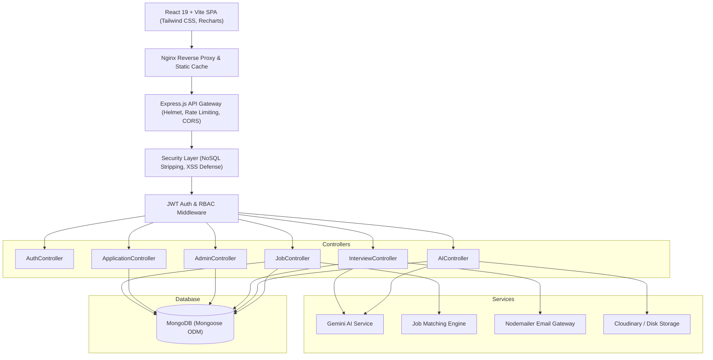

<div align="center">

# 🧭 CareerPilot AI
### Intelligent AI-Powered Career Management & Recruitment Platform

[](https://nodejs.org/)
[](https://react.dev/)
[](https://expressjs.com/)
[](https://www.mongodb.com/)
[](https://www.docker.com/)
[](https://vitejs.dev/)
[](https://tailwindcss.com/)
[](https://opensource.org/licenses/ISC)

<p align="center">
  <strong>An enterprise-ready SaaS application bridging the gap between ambitious Job Seekers and high-growth Recruiters through artificial intelligence, algorithmic vacancy matching, ATS resume evaluation, dynamic mock interviews, and automated recruitment pipelines.</strong>
</p>

[Explore Features](#-key-features) •
[Architecture](#-system-architecture) •
[Quickstart](#-quickstart-guide) •
[Docker Deployment](#-docker--container-deployment) •
[API Reference](#-complete-rest-api-documentation) •
[Testing](#-automated-testing-suite)

</div>

---

## 📌 Project Overview

**CareerPilot AI** is built from the ground up to reflect a real-world, commercial SaaS application rather than a basic tutorial project. It resolves critical pain points in modern tech hiring:
1. **For Job Seekers**: Disorganized job tracking, opaque ATS screening rejections, generic interview preparation, and lack of clarity on skill gaps needed for target roles.
2. **For Recruiters**: Overwhelming volume of unqualified applicant resumes, manual candidate screening, scattered interview coordination, and lack of unified pipeline funnel analytics.
3. **For Administrators**: Real-time SaaS platform health, user ecosystem oversight, role governance, and job posting moderation.

---

## ✨ Key Features

### 👤 Role-Based Portals & Access Control (RBAC)
- **Job Seeker**: Candidate profile builder, resume upload & ATS evaluation, AI match scoring, personalized learning roadmaps, interactive AI mock interviews, and application pipeline tracking.
- **Recruiter**: Company branding, job vacancy publishing & status management, applicant review, resume inspection, interview scheduling with email invitations, and recruiter funnel analytics.
- **Admin**: Platform-wide metrics (users, applications, jobs, interviews), 6-month growth analytics, user activation/deactivation toggles, role modifications, and job moderation.

### 🤖 Intelligent AI Capabilities
- **AI Resume ATS Analyzer**: Extracts text from PDF/Word documents, computes overall ATS score (0–100), breaks down structural strengths/weaknesses, identifies formatting issues, and suggests targeted improvements. Powered by **Google Gemini API** with an intelligent heuristic fallback.
- **Multi-Dimensional AI Job Matching**: Computes a real-time compatibility score across 4 key dimensions:
  $$\text{Match} = (\text{Skills} \times 45\%) + (\text{Experience} \times 25\%) + (\text{Location} \times 15\%) + (\text{Role Semantics} \times 15\%)$$
- **Interactive AI Mock Interviewer**: Generates customized role-specific interview questions based on candidate skills, target vacancy, and difficulty level. Evaluates answers across Technical Depth, Communication Clarity, and Confidence with detailed scorecards.
- **AI Skill Gap & Learning Roadmap**: Compares candidate capabilities against current market vacancies, generates missing skills priority matrix, and produces weekly learning roadmaps with free high-quality resource links.

### 💼 Job & Application Management
- **Full-Text Multi-Criteria Job Search**: Instant debounced search with MongoDB compound indexes matching title, company, skills, location, workplace type (Remote, Hybrid, On-site), and salary ranges.
- **Recruitment Funnel**: Multi-stage application pipeline (`Applied` $\rightarrow$ `Under Review` $\rightarrow$ `Shortlisted` $\rightarrow$ `Interview` $\rightarrow$ `Selected` / `Rejected`).
- **Interview Scheduling Gateway**: Coordinates dates, times, and meeting links with transactional email notifications dispatched via **Nodemailer**.

### 🛡️ Enterprise Security & Validation
- **NoSQL Injection Defense**: Recursive sanitization stripping Mongo operators (`$`) and dot notation (`.`) from incoming payloads.
- **XSS Protection**: HTML and script tag neutralization across all user inputs.
- **Brute-Force Rate Limiting**: Dedicated rate limiting on authentication and AI endpoints.
- **Mongoose Error Normalization**: Graceful handling of duplicate emails (409 Conflict) and malformed ObjectIds (400 Bad Request) without exposing stack traces in production.

---

## 🏗 System Architecture

CareerPilot AI follows a clean **Controller-Service-Model** pattern, enforcing strict separation of concerns:



---

## 💻 Tech Stack

| Layer | Technologies |
|---|---|
| **Frontend** | React 19, Vite, Tailwind CSS, Lucide React, Recharts, React Router v7, React Hook Form, Axios |
| **Backend** | Node.js 20+, Express.js, Mongoose ODM, JWT, bcryptjs, Helmet, Express Rate Limit, Multer |
| **Database** | MongoDB 7.0 (Compound Text Indexes, Relational Refs) |
| **AI & Cloud** | Google Gemini API (with Heuristic Fallback), Cloudinary API, Nodemailer SMTP |
| **DevOps** | Docker, Docker Compose, Nginx, GitHub Actions CI/CD, Render, Railway, Vercel |

---

## 🚀 Quickstart Guide

### Prerequisites
- **Node.js**: `v20.0.0` or higher
- **MongoDB**: Local MongoDB instance running on `mongodb://127.0.0.1:27017` or a MongoDB Atlas cloud URI.
- **Git**

### 1. Clone the Repository
```bash
git clone https://github.com/your-username/careerpilot-ai.git
cd "careerpilot-ai"
```

### 2. Backend Setup
```bash
cd backend
npm install
cp .env.example .env
```
*Edit `.env` to customize your `JWT_SECRET` and optional cloud credentials (Gemini, Cloudinary, Email).*

Start the backend development server:
```bash
npm run dev
# Backend running at http://localhost:5000
# Health check: http://localhost:5000/api/health
```

### 3. Frontend Setup
In a separate terminal:
```bash
cd frontend
npm install
npm run dev
# Frontend running at http://localhost:5173
```

---

## 🐳 Docker & Container Deployment

The complete full-stack environment (Frontend, Backend, and MongoDB) can be run containerized with a single command:

```bash
docker compose up --build
```

### Access Services:
- **Frontend Web App**: [http://localhost:5173](http://localhost:5173)
- **Backend API**: [http://localhost:5000](http://localhost:5000)
- **API Health Check**: [http://localhost:5000/api/health](http://localhost:5000/api/health)
- **MongoDB**: `localhost:27017`

To stop containers while preserving database volume:
```bash
docker compose down
```

---

## 🔑 Environment Variables Reference

| Variable | Description | Default / Example |
|---|---|---|
| `PORT` | Backend HTTP listening port | `5000` |
| `NODE_ENV` | Application environment (`development` / `production` / `test`) | `development` |
| `CLIENT_URL` | Frontend URL for CORS authorization | `http://localhost:5173` |
| `MONGO_URI` | MongoDB connection string (Local or Atlas) | `mongodb://127.0.0.1:27017/careerpilot_ai` |
| `JWT_SECRET` | 32+ character key for signing authentication tokens | `your_secret_key` |
| `JWT_EXPIRES_IN` | Token lifespan | `7d` |
| `GEMINI_API_KEY` | *(Optional)* Google AI Studio API key for resume parsing | *(Fallback heuristic active if empty)* |
| `CLOUDINARY_CLOUD_NAME` | *(Optional)* Cloudinary storage bucket | *(Fallback /uploads active if empty)* |
| `CLOUDINARY_API_KEY` | *(Optional)* Cloudinary API key | |
| `CLOUDINARY_API_SECRET` | *(Optional)* Cloudinary secret | |
| `EMAIL_USER` | *(Optional)* SMTP sender email address | *(Simulated console delivery if empty)* |
| `EMAIL_PASS` | *(Optional)* SMTP App Password | |
| `VITE_API_BASE_URL` | Frontend API proxy root | `/api` |

---

## 📖 Complete REST API Documentation

All endpoints return a standardized JSON envelope:
```json
{
  "success": true,
  "statusCode": 200,
  "message": "Operation completed successfully",
  "data": {}
}
```

### 🔐 Authentication (`/api/auth`)
| Method | Endpoint | Access | Description |
|---|---|---|---|
| `POST` | `/api/auth/register` | Public | Register new candidate or recruiter account |
| `POST` | `/api/auth/login` | Public | Authenticate user & receive JWT token |
| `GET` | `/api/auth/me` | Private | Retrieve authenticated user profile |
| `PUT` | `/api/auth/update-password` | Private | Change account password |
| `POST` | `/api/auth/forgot-password` | Public | Initiate password reset token |
| `PUT` | `/api/auth/reset-password/:resetToken` | Public | Reset password using emailed token |

### 💼 Jobs & Recommendations (`/api/jobs` & `/api/matches`)
| Method | Endpoint | Access | Description |
|---|---|---|---|
| `GET` | `/api/jobs` | Public | Search and filter jobs (keyword, workplace, salary, pagination) |
| `GET` | `/api/jobs/:id` | Public | Retrieve job details by ID |
| `POST` | `/api/jobs` | Recruiter/Admin | Create and publish a new job posting |
| `PUT` | `/api/jobs/:id` | Recruiter/Admin | Update existing job details |
| `DELETE` | `/api/jobs/:id` | Recruiter/Admin | Delete job posting |
| `PATCH` | `/api/jobs/:id/status` | Recruiter/Admin | Toggle status (`Active`, `Closed`, `Draft`) |
| `GET` | `/api/jobs/recruiter/my-jobs` | Recruiter/Admin | List recruiter's published vacancies |
| `POST` | `/api/jobs/:id/save` | Candidate | Bookmark or unsave a job posting |
| `GET` | `/api/jobs/saved` | Candidate | Fetch candidate's bookmarked jobs |
| `GET` | `/api/matches/recommendations` | Candidate | Fetch jobs ranked by candidate compatibility score |
| `GET` | `/api/matches/job/:jobId` | Candidate | Real-time 4-factor match diagnostics for a job |
| `GET` | `/api/matches/recruiter/job/:jobId/top-candidates` | Recruiter/Admin | Top candidates matching an open vacancy |

### 📝 Applications (`/api/applications`)
| Method | Endpoint | Access | Description |
|---|---|---|---|
| `POST` | `/api/applications/apply/:jobId` | Candidate | Submit job application with cover letter & resume |
| `GET` | `/api/applications/my-applications` | Candidate | Retrieve candidate's submitted application pipeline |
| `GET` | `/api/applications/check/:jobId` | Candidate | Check existing application status for a job |
| `GET` | `/api/applications/recruiter` | Recruiter/Admin | Recruiter applicants overview across all jobs |
| `GET` | `/api/applications/job/:jobId` | Recruiter/Admin | View applicant pool for a specific job |
| `PATCH` | `/api/applications/:id/status` | Recruiter/Admin | Update candidate funnel stage |

### 📅 Interview Coordination & AI Mock Sessions (`/api/interviews`)
| Method | Endpoint | Access | Description |
|---|---|---|---|
| `POST` | `/api/interviews/schedule` | Recruiter/Admin | Schedule interview & dispatch email invitation |
| `GET` | `/api/interviews/recruiter` | Recruiter/Admin | Fetch recruiter's scheduled interviews & statistics |
| `GET` | `/api/interviews/candidate` | Candidate/Admin | Fetch candidate's scheduled interviews |
| `PATCH` | `/api/interviews/scheduled/:id` | Recruiter/Admin | Update interview status or reschedule |
| `POST` | `/api/interviews/start` | Candidate | Start AI mock interview session with generated questions |
| `POST` | `/api/interviews/session/:id/answer` | Candidate | Submit answer and receive instantaneous AI feedback |
| `POST` | `/api/interviews/session/:id/complete` | Candidate | Finalize session and generate performance scorecard |
| `GET` | `/api/interviews/history` | Candidate | Review previous mock interview scorecards |

### 🧠 AI Resume & Learning Roadmap (`/api/ai` & `/api/roadmaps`)
| Method | Endpoint | Access | Description |
|---|---|---|---|
| `POST` | `/api/ai/analyze-resume` | Candidate | Upload resume document and run ATS diagnostic analysis |
| `GET` | `/api/ai/analyses` | Candidate | List previous resume evaluation reports |
| `GET` | `/api/roadmaps` | Candidate | Fetch candidate's current personalized skill roadmap |
| `POST` | `/api/roadmaps/generate` | Candidate | Generate personalized multi-week learning curriculum |
| `PATCH` | `/api/roadmaps/milestones/:milestoneId` | Candidate | Toggle learning milestone completion status |

### 🛡️ Administration & Moderation (`/api/admin`)
| Method | Endpoint | Access | Description |
|---|---|---|---|
| `GET` | `/api/admin/dashboard` | Admin Only | Platform KPI metrics, growth timelines, and role distributions |
| `GET` | `/api/admin/users` | Admin Only | Paginated user directory with search and role filters |
| `PATCH` | `/api/admin/users/:id/status` | Admin Only | Activate or deactivate user account (with self-guard) |
| `PATCH` | `/api/admin/users/:id/role` | Admin Only | Elevate or modify user role |
| `DELETE` | `/api/admin/users/:id` | Admin Only | Delete user account permanently |
| `GET` | `/api/admin/jobs` | Admin Only | Platform-wide job listing oversight |
| `PATCH` | `/api/admin/jobs/:id/status` | Admin Only | Moderate and override job status |
| `DELETE` | `/api/admin/jobs/:id` | Admin Only | Delete non-compliant job postings |

---

## 🧪 Automated Testing Suite

CareerPilot AI features an automated test runner combining unit tests and end-to-end integration tests without third-party runner conflicts:

```bash
cd backend
npm test
```

### Test Coverage Highlights:
- **Unit Tests (11/11 Passing)**: Bcrypt password hashing & salt verification, JWT generation & verification, recursive NoSQL injection operator stripping, and XSS script tag neutralizing.
- **Integration Tests (14/14 Passing)**: Candidate/Recruiter registration, RBAC authorization barriers, job creation, full-text search, application submissions, duplicate application prevention, recruiter stage changes, interview scheduling with email dispatch, AI match diagnostics, and admin metrics.
- **Overall**: **25 / 25 Tests Passing (100% Pass Rate)** in under 1.5 seconds.

### Pre-Flight Production Readiness Audit:
```bash
npm run verify:prod
```
Validates runtime engine version, environment secret integrity, live database connectivity, compiled frontend asset bundle presence, and cloud manifests.

---

## 📁 Repository Folder Structure

```
CareerPilot AI/
├── .github/
│   └── workflows/
│       └── ci.yml                   # GitHub Actions CI/CD Pipeline
├── backend/
│   ├── src/
│   │   ├── config/                  # Database connection & environment variables
│   │   ├── controllers/             # Request handlers for all domain entities
│   │   ├── middlewares/             # Auth, RBAC, Sanitization, Rate-limits, Uploads, Errors
│   │   ├── models/                  # Mongoose Schemas (User, Job, Application, Interview, etc.)
│   │   ├── routes/                  # Modular Express route declarations
│   │   ├── scripts/                 # Test suites & deployment verification audits
│   │   ├── services/                # AI, Matching, and Email business logic
│   │   ├── tests/                   # Unit and API integration test suites
│   │   ├── utils/                   # ApiError, ApiResponse, asyncHandler helpers
│   │   ├── app.js                   # Express application configuration & middleware pipeline
│   │   └── server.js                # Server entry point & graceful shutdown hooks
│   ├── .dockerignore
│   ├── .env.example
│   ├── Dockerfile                   # Node 20 production container
│   └── package.json
├── frontend/
│   ├── src/
│   │   ├── components/              # Reusable UI components (Navbar, Modals, Badges)
│   │   ├── context/                 # AuthContext & global state management
│   │   ├── pages/                   # SaaS view pages (Dashboards, Jobs, Interviews, Roadmaps)
│   │   ├── services/                # Axios API client & interceptors
│   │   ├── App.jsx                  # React Router v7 routes & protected route wrappers
│   │   └── main.jsx
│   ├── .dockerignore
│   ├── .env.example
│   ├── Dockerfile                   # 2-stage multi-stage Vite + Nginx build
│   ├── nginx.conf                   # Production Nginx SPA & API reverse proxy config
│   ├── package.json
│   ├── tailwind.config.js
│   ├── vercel.json                  # Vercel deployment manifest
│   └── vite.config.js
├── .dockerignore                    # Root Docker exclusions
├── .env.example                     # Root environment template
├── docker-compose.yml               # Multi-container orchestration (Mongo + Backend + Frontend)
├── railway.json                     # Railway deployment configuration
├── render.yaml                      # Render Blueprint (Web service + Static site)
└── README.md                        # Master project documentation
```

---

## 🚢 Cloud Deployment Guides

### Option 1: Render (Blueprint Deployment)
1. Push your repository to GitHub.
2. Log into [Render](https://render.com/) and navigate to **Blueprints**.
3. Select this repository; Render will automatically detect [`render.yaml`](file:///e:/Project/CareerPilot%20AI/render.yaml) and configure both the backend service and the frontend static site.
4. Supply your `MONGO_URI` (from MongoDB Atlas) in the Render dashboard.

### Option 2: Railway (Docker Deployment)
1. Connect your repository to [Railway](https://railway.app/).
2. Railway detects [`railway.json`](file:///e:/Project/CareerPilot%20AI/railway.json) and [`docker-compose.yml`](file:///e:/Project/CareerPilot%20AI/docker-compose.yml).
3. Add environment variables in the Railway dashboard and deploy.

### Option 3: Vercel (Frontend) + Render / Railway (Backend)
1. Deploy `frontend/` to [Vercel](https://vercel.com/); [`frontend/vercel.json`](file:///e:/Project/CareerPilot%20AI/frontend/vercel.json) handles client-side routing.
2. In Vercel Project Settings, set `VITE_API_BASE_URL` to your live backend domain (e.g. `https://api.careerpilot.io`).
3. Deploy `backend/` as a Node web service on Render or Railway with MongoDB Atlas connection string.

---

## 🎯 Portfolio & Placement Highlights

If you are evaluating this project for software engineering positions or technical assessments, note the following design decisions:

1. **Security-First Architecture**: No plain-text passwords (`bcryptjs` salt rounds: 10), JWT verification middleware, recursive NoSQL injection sanitizers stripping malicious selector keys, XSS neutralization, and IP brute-force rate limiters.
2. **Defensive Database Modeling**: Compound text indexes for instantaneous multi-criteria job search, unique compound constraints preventing duplicate applications, and indexed status fields for fast aggregation.
3. **Resilient AI Integrations**: AI endpoints are designed with heuristic fallback algorithms, ensuring the platform continues to function gracefully even without third-party API keys or during upstream rate limits.
4. **Production-Ready DevOps**: 2-stage multi-stage Dockerfiles reduce frontend production image sizes by ~90% by serving built assets with Nginx Alpine. Full orchestration with health checks and persistent volume drivers.

---

## 📄 License
This project is open source and available under the [ISC License](LICENSE).
